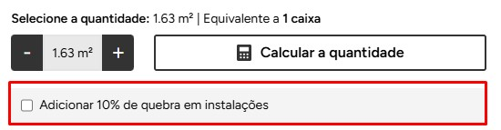

# Componente react `AdicionalDeQuebras` para pisos em Vtex IO

O componente `AdicionalDeQuebras` é utilizado para adicionar de **10% à quantidade de produtos**, é útil para **pisos** que requer cálculos por metros. Ele é integrado ao contexto de produto da VTEX para manipular a quantidade de produtos de forma dinâmica.



## Exemplo de uso
interface.json
```
"adicional-de-quebras": {
    "component": "AdicionalDeQuebras"
},
```

Chamando na página do produto:
```
"adicional-de-quebras"
______
 
"condition-layout.product#adicional-de-quebras": {
    "props": {
      "conditions": [
        {
          "subject": "specificationProperties", // EXEMPLO
          "arguments": {
            "name": "Formato (cm)" // EXEMPLO
          }
        }
      ],
      "Then": "adicional-de-quebras"
    }
}
```