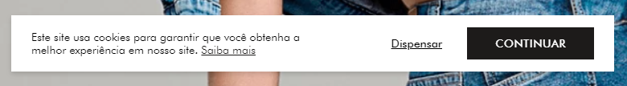
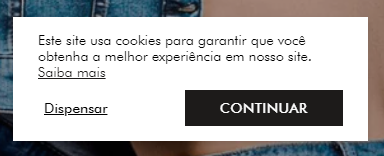

# CookieConsent Component

Este é um componente React de aviso de cookies, que exibe uma mensagem para os usuários sobre o uso de cookies no site. O componente permite que o usuário aceite ou dispense o uso de cookies. A escolha é salva no `localStorage`, para garantir que o aviso não seja exibido novamente caso o usuário clique em "concordar".

## Funcionalidades

- Exibe uma mensagem sobre o uso de cookies com um link para mais informações.
- Possui dois botões: "Dispensar" e "Continuar".
- Ao clicar em "Continuar", a escolha é salva no `localStorage` e o aviso não será exibido novamente em visitas futuras.
- Ao clicar em "Dispensar", o aviso é simplesmente ocultado sem salvar a preferência.

## Pré-requisitos

- React 16.8 ou superior (devido ao uso de hooks como `useState` e `useEffect`).
- Um ambiente configurado com o Node.js e NPM/Yarn.

## Exemplo

### Desktop

### Mobile
