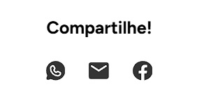

# Documentação do Componente ShareProduct

O componente `ShareProduct` renderiza uma seção de compartilhamento, onde os usuários podem compartilhar a página atual do produto via WhatsApp, e-mail ou Facebook. Ele gera links de compartilhamento dinamicamente com base no título e URL da página atual.

