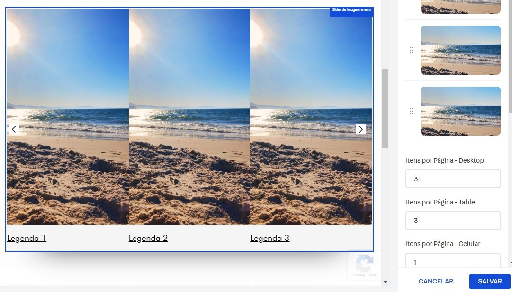

SliderImgsWithCaption Component
===============================

Este componente React exibe um carrossel de imagens com legendas, usando o `SliderLayout` do VTEX IO. Ele inclui as mesmas configurações de `SliderLayout` (número de itens visíveis por página, transições de slides, autoplay, e outros).



Exemplo de Uso
-------------- 

interface.json
```
"slider-imgs-with-caption": {
    "component": "SliderImgsWithCaption"
},
```

Chamando no tema:
```
"slider-imgs-with-caption"

-------------- 

"flex-layout.col#minha-col": { 
    "children": [ 
        "slider-imgs-with-caption"
    ]
}
```

Opções de adicionar imagens e configurações do slide serão exibidas no Site Editor.


Propriedades
------------ 
| Propriedade            | Tipo                                                  | Valor Padrão                               | Descrição                                                                                       |
|------------------------|------------------------------------------------------|-------------------------------------------|-------------------------------------------------------------------------------------------------|
| `items`                | `SliderImgsWithCaptionPropsContent[]`                | `[]`                                      | Array de itens a serem exibidos, cada um contendo `imagem`, `alt`, `link`, `texto`, `largura`, etc. |
| `itemsPerPage`         | `itemsPerPageProps`                                  | `{ desktop: 5, tablet: 3, phone: 1 }`     | Itens exibidos por página para desktop, tablet e celular.                                     |
| `slideTransition`      | `slideTransitionProps`                               | `{ speed: 0, delay: 0, timing: '' }`      | Controla a velocidade da transição do slide, atraso e temporização.                             |
| `autoplay`             | `autoplayProps`                                      | `{ timeout: undefined, stopOnHover: undefined }` | Configurações de autoplay com opções de tempo limite e parar ao passar o mouse.                |
| `infinite`             | `boolean`                                            | `false`                                   | Habilita a rolagem infinita dos slides.                                                         |
| `showNavigationArrows` | `"mobileOnly", "desktopOnly", "always", "never"`   | `"always"`                                | Determina a visibilidade das setas de navegação.                                               |
| `showPaginationDots`   | `"mobileOnly", "desktopOnly", "always", "never"`   | `"never"`                                 | Determina a visibilidade dos pontos de paginação.                                              |


### Propriedades de `SliderImgsWithCaptionPropsContent` 

| Propriedade            | Tipo                              | Valor Padrão     | Descrição                                                                                           |
|------------------------|-----------------------------------|------------------|-----------------------------------------------------------------------------------------------------|
| `image`               | `string`                          | **Obrigatório**   | URL da imagem a ser exibida no slide.                                                               |
| `alt`                  | `string`                          | `""`             | Texto alternativo para a imagem, para acessibilidade e SEO.                                         |
| `link`                 | `string`                          | `""`             | URL para a qual o slide vincula, se aplicável.                                                     |
| `openInNewTab`        | `boolean`                         | `false`          | Se `true`, abre o link em uma nova aba do navegador.                                               |
| `text`                | `string`                          | `""`             | Texto da legenda a ser exibido no slide.                                                           |
| `tagText`             | `keyof JSX.IntrinsicElements`     | `h2`             | Tag HTML para o texto da legenda. Suporta valores como `h2`, `h3`, `h4`, `h5`, `h6` e `p`.         |
| `width`             | `number`                          | `null`           | Largura da imagem em pixels. Se omitido, ajusta automaticamente com base no layout.                |
| `height`              | `number`                          | `null`           | Altura da imagem em pixels. Se omitido, ajusta automaticamente com base no layout.                 |
| `loading`             | `"eager", "lazy"`                | `"eager"`        | Comportamento de carregamento da imagem: `eager` carrega imediatamente, `lazy` adia o carregamento até a imagem estar em vista. |


### Propriedades de `itemsPerPageProps`
| Nome da Prop           | Tipo   | Descrição                                                   | Valor Padrão |
|------------------------|--------|-------------------------------------------------------------|---------------|
| desktop                | number | O número de slides a serem exibidos em dispositivos desktop. | 5             |
| tablet                 | number | O número de slides a serem exibidos em dispositivos tablet.  | 3             |
| phone                  | number | O número de slides a serem exibidos em dispositivos móveis.  | 1             |


### Propriedades de `slideTransitionProps` 
| Nome da Prop           | Tipo   | Descrição                                             | Valor Padrão |
|------------------------|--------|------------------------------------------------------|---------------|
| speed                  | number | Velocidade da transição (em ms).                     | 400           |
| delay                  | number | Atraso entre a transição dos slides (em ms).        | 0             |
| timing                 | string | Função de temporização.                              | ''            |


### Propriedades de `autoplayProps`  
| Nome da Prop           | Tipo     | Descrição                                                                                     | Valor Padrão |
|------------------------|----------|-------------------------------------------------------------------------------------------------|---------------|
| timeout                | number   | Tempo limite (em ms) entre cada slide.                                                        | undefined     |
| stopOnHover            | boolean  | Determina se o autoplay deve parar quando os usuários estão passando o mouse sobre o slider (true) ou não (false). | undefined     |

-------------------------------
 
### Links úteis:

* Slider Layout by Vtex: https://developers.vtex.com/docs/apps/vtex.slider-layout


Tem algo à acrescentar? Não deixe de colaborar :)