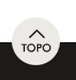

# Componente VoltarAoTopo

Este componente React cria um botão "Voltar ao Topo" para VTEX IO. O botão aparece automaticamente quando o usuário rola a página para baixo além de um certo ponto e retorna ao topo suavemente ao ser clicado. Além disso, adiciona uma classe ao body quando o usuário está próximo do final da página, para evitar que o botão fique sobre selos do rodapé.

